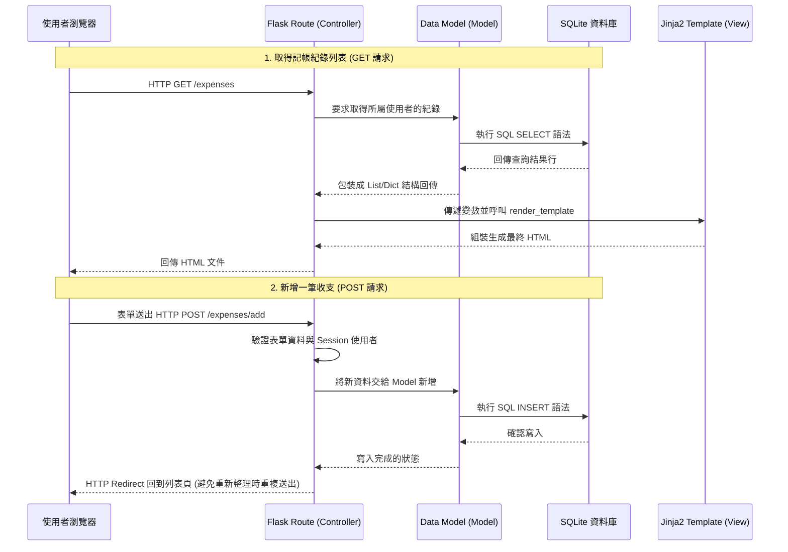

# 系統架構文件 (ARCHITECTURE)：個人記帳簿系統

## 1. 技術架構說明

本專案採用經典的單體式架構 (Monolithic Architecture)，不採取前後端分離，藉此保持專案輕量並加速開發，適合快速驗證產品核心功能。

- **選用技術與原因**：
  - **後端框架：Python + Flask**。Flask 是一個輕量且高彈性的 Python Web 框架，學習曲線平緩，沒有過多的框架負擔，非常適合開發輕巧的個人記帳應用。
  - **模板引擎：Jinja2**。隨 Flask 內建，負責從後端接收資料並生成動態 HTML 頁面。它的語法直覺且支援條件判斷與迴圈，能幫助我們快速建構出前端畫面。
  - **資料庫：SQLite3**。身為個人記帳系統，資料庫的存取主要是單一用戶的查詢與寫入。內建的 SQLite 即插即用，無需架設獨立的資料庫伺服器，降低了部屬與維護心力。

- **MVC 架構模式的對應**：
  - **M (Model) 型態與資料邏輯**：對應我們在資料庫裡的資料表操作，負責對 SQLite 資料庫發出 SQL 指令，處理資料的儲存、查詢與關聯（例如使用者與帳目的關聯）。
  - **V (View) 視圖呈現**：由 Jinja2 模板搭配前端靜態資源 (CSS/JS) 構成，負責將後端傳來的資料渲染為瀏覽器上可視的 HTML 頁面。
  - **C (Controller) 業務邏輯與流程控制**：由 Flask 的路由 (Routes) 扮演 Controller 角色。接收使用者的請求 (Request)、調用對應的 Model 取得資料、最後呼叫 View 回傳響應 (Response)。

## 2. 專案資料夾結構

本專案的目錄結構遵循 Flask 常見的模組化拆分原則，結構設計如下：

```text
web_app_development/
├── app/                      ← 應用程式主目錄
│   ├── models/               ← 資料庫模型與操作邏輯 (Model)
│   │   ├── user.py           ← 使用者處理與驗證 
│   │   ├── expense.py        ← 收支紀錄處理
│   │   └── category.py       ← 分類項目處理
│   ├── routes/               ← Flask 路由定義 (Controller)
│   │   ├── auth.py           ← 登入、註冊相關路由
│   │   ├── expense.py        ← 新增、查詢、刪除記帳紀錄路由
│   │   └── admin.py          ← 管理員檢視所有用戶的路由
│   ├── templates/            ← Jinja2 HTML 模板 (View)
│   │   ├── base.html         ← 頁面全域共用框架 (母模板)
│   │   ├── auth/             ← 登入與註冊頁面
│   │   └── expense/          ← 操作儀表板、表單頁面
│   ├── static/               ← 前端靜態資源
│   │   ├── css/              ← 樣式表 (負責視覺設計)
│   │   └── js/               ← 前端互動腳本
│   └── __init__.py           ← Flask App 初始化設定 (建立實例與 Blueprint 註冊)
├── instance/                 ← 不進入版控的環境與運行檔案
│   └── database.db           ← SQLite 資料庫本體
├── docs/                     ← 專案文件存放區
│   ├── PRD.md                ← 產品需求文件
│   └── ARCHITECTURE.md       ← 系統架構文件 (本文件)
├── requirements.txt          ← Python 依賴套件清單 
├── config.py                 ← 系統環境變數與參數設定
└── app.py                    ← 專案進入點 (開發伺服器啟動)
```

## 3. 元件關係圖

以下呈現資料在系統各元件中的傳遞方式與處理順序：



## 4. 關鍵設計決策

1. **使用 Flask Blueprints 進行模組化拆分**：
   - **原因**：將路由分為 `auth`, `expense`, `admin` 能避免未來所有程式碼擠在同一個檔案內，讓路由的管理如同功能的負責區域一樣直覺且易於多人協作。
2. **不使用 ORM，選用直接呼叫 SQLite 搭配 sqlite3 或輕量封裝**：
   - **原因**：為了讓資料庫的行為完全透明，初期可考慮採用原生的 `sqlite3` 進行參數化查詢（防範 Injection）或是採用單純的 Helper 函數。若需使用 ORM (如 SQLAlchemy) 也是可行方案，但考量純屬輕量級系統，越簡單越能避免設定地雷。
3. **安全防護：Session ID 與密碼加密隔離**：
   - **原因**：在資料庫層，使用 `werkzeug.security` 中的 Hash 演算法儲存密碼。在應用層，透過 Flask 強大的加密 Session 儲存目前訪問者的 User_ID，讓未登入者或嘗試竄改 ID 的惡意請求能在路由層被輕易攔截下來。
4. **Jinja2 模板繼承 (Template Inheritance)**：
   - **原因**：將導覽列、頁尾底端、通用 CSS 匯入等基礎設施放置於 `base.html`，其餘頁面只需要繼承並覆寫主視覺區塊 (``)。這讓日後的 UI 佈景調整達到事半功倍之效。
