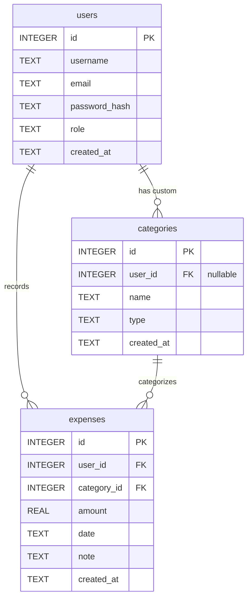

# 資料庫設計 (Database Design)

本文件根據產品需求文件 (PRD) 與系統架構，定義出個人記帳簿系統的資料庫 Schema 設計與關聯。

## ER 圖 (實體關係圖)

## 資料表詳細說明

### 1. `users` (使用者表)

儲存系統使用者的認證資料。

| 欄位名稱        | 資料型別    | 必填 | 說明                                |
|-----------------|-------------|------|-------------------------------------|
| `id`            | INTEGER     | 是   | Primary Key (自動遞增)              |
| `username`      | TEXT        | 是   | 登入用使用者名稱，需為唯一          |
| `email`         | TEXT        | 是   | 聯絡或找回密碼之信箱，需為唯一      |
| `password_hash` | TEXT        | 是   | 經過雜湊處理的密碼                  |
| `role`          | TEXT        | 是   | 使用者角色，例如 `user` 或 `admin`，預設為 `user` |
| `created_at`    | TEXT        | 是   | 建立時間，格式 ISO 8601             |

### 2. `categories` (收支分類表)

儲存系統預設或使用者自訂的收支分類項目。

| 欄位名稱        | 資料型別    | 必填 | 說明                                |
|-----------------|-------------|------|-------------------------------------|
| `id`            | INTEGER     | 是   | Primary Key (自動遞增)              |
| `user_id`       | INTEGER     | 否   | Foreign Key 關聯至 `users(id)`。若為 NULL 代表系統公用戶（預設分類） |
| `name`          | TEXT        | 是   | 分類名稱，如 `餐飲`、`薪水`、`交通` |
| `type`          | TEXT        | 是   | 收支類型，如 `expense` (支出)、`income` (收入) |
| `created_at`    | TEXT        | 是   | 建立時間，格式 ISO 8601             |

### 3. `expenses` (收支紀錄表)

儲存每一筆記帳的金額與紀錄。

| 欄位名稱        | 資料型別    | 必填 | 說明                                |
|-----------------|-------------|------|-------------------------------------|
| `id`            | INTEGER     | 是   | Primary Key (自動遞增)              |
| `user_id`       | INTEGER     | 是   | Foreign Key 關聯至 `users(id)`      |
| `category_id`   | INTEGER     | 是   | Foreign Key 關聯至 `categories(id)` |
| `amount`        | REAL        | 是   | 收支金額                            |
| `date`          | TEXT        | 是   | 記帳發生的日期，格式 (YYYY-MM-DD)   |
| `note`          | TEXT        | 否   | 附加備註                            |
| `created_at`    | TEXT        | 是   | 建立時間，格式 ISO 8601             |
