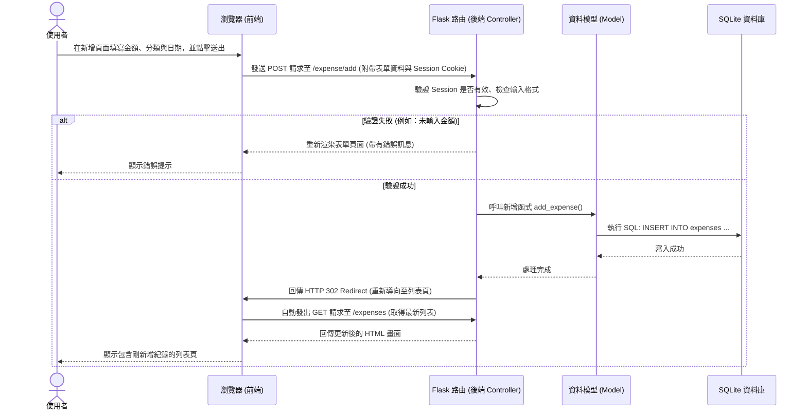

# 系統流程圖文件 (FLOWCHART)：個人記帳簿系統

本文件根據 PRD 需求與主要架構設計，繪製了使用者的操作流程圖及系統處理資料的序列圖。

## 1. 使用者流程圖 (User Flow)

此圖展示了當一般使用者進入系統後，可能會經歷的各項操作路徑，包含註冊登入、日常記帳與查看報表等核心功能。

```mermaid
flowchart LR
    A([使用者造訪網站]) --> B{是否已登入？}
    
    B -->|否| C[登入 / 註冊頁面]
    C -->|送出憑證| D{驗證成功？}
    D -->|否| C
    D -->|是| E[首頁 (記帳儀表板)]
    
    B -->|是| E
    
    E --> F{選擇操作項目}
    
    F -->|檢視清單/搜尋| G[收支紀錄列表]
    F -->|新增收支| H[填寫收支表單]
    F -->|查看圖表| I[每月收支統計報表]
    F -->|登出| J([離開系統])
    
    G --> K{對特定紀錄操作}
    K -->|編輯| L[編輯表單]
    K -->|刪除| M[確認刪除]
    
    L --> G
    M --> G
    H --> G
```

### 管理員專屬流程


## 2. 系統序列圖 (Sequence Diagram)

以下說明當使用者完成表單填寫並「新增一筆收支紀錄」時，資料如何在前後端之間的傳遞與儲存流程。



## 3. 功能清單對照表

本表列出系統主要功能及其對應的暫定路由與 HTTP 請求方法，以供後續後端開發時之參考：

| 功能項目 | 功能描述 | URL 路徑 (暫定) | HTTP 方法 |
| --- | --- | --- | --- |
| 註冊 | 新使用者建立帳號 | `/auth/register` | `GET`, `POST` |
| 登入 | 使用者登入取得 Session | `/auth/login` | `GET`, `POST` |
| 登出 | 清除登入狀態 | `/auth/logout` | `POST` 或 `GET` |
| 儀表板/首頁 | 顯示摘要與近期紀錄 | `/` | `GET` |
| 列表與搜尋 | 檢視收支紀錄及進行關鍵字/日期篩選 | `/expenses` | `GET` |
| 新增收支 | 表單頁面與資料送出 | `/expense/add` | `GET`, `POST` |
| 編輯收支 | 修改指定的收支資料 | `/expense/edit/<id>` | `GET`, `POST` |
| 刪除收支 | 刪除單筆收支紀錄 | `/expense/delete/<id>` | `POST` |
| 統計報表 | 查看每月的收支統計與圖表 | `/reports` | `GET` |
| 分類管理 | 顯示與新增自訂分類 | `/categories` | `GET`, `POST` |
| 後台使用者管理 | (管理員專屬) 查看與管理註冊名單 | `/admin/users` | `GET`, `POST` |
